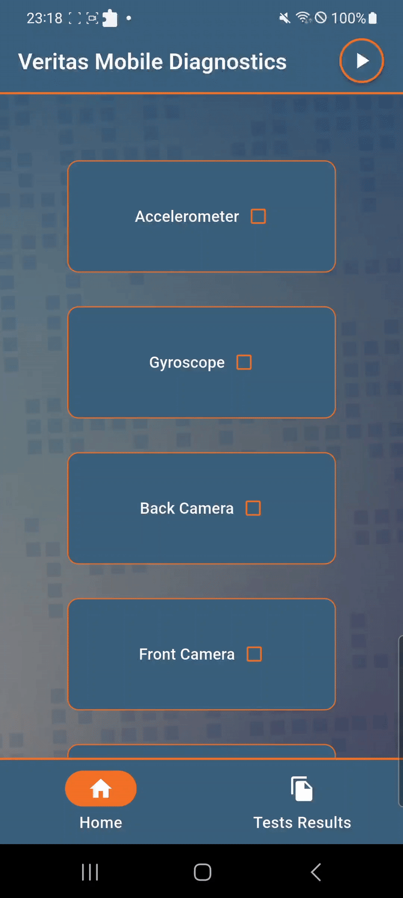
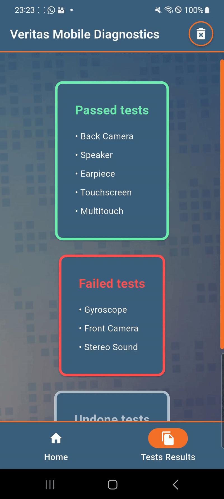
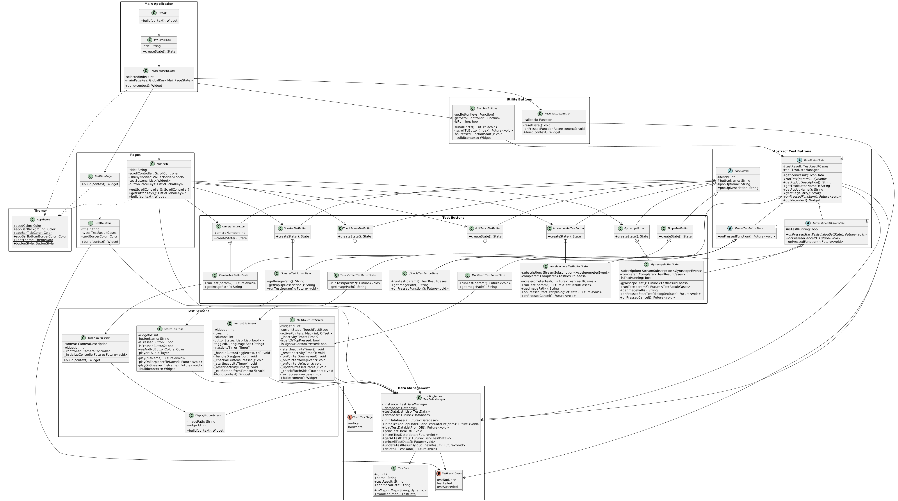

# Veritas Mobile Diagnostics
**Quick, simple and accurate hardware diagnostics for mobile devices**
## About
**Veritas Mobile Diagnostics** is a Flutter-based mobile application designed to thoroughly test and diagnose mobile device hardware components. The app currently provides 9 specialized diagnostic tests—both automatic sensor-based tests and manual user-guided assessments—to ensure every critical hardware component functions correctly.

Each test features intuitive step-by-step instructions, real-time visual feedback, and automatic result persistence through a local SQLite database. The application offers two main interfaces: a **Test Page** where users can execute all tests sequentially with a single tap or run them individually, and a **Results Page** that organizes outcomes into clear categories (Passed, Failed, Not Done) for easy analysis and reporting.

## Application Interfaces 
  

  
   
  <b>Test Page</b>

   

  
   
  <b>Results Page</b>

## Available Tests

| # | Test | Type | Description |
|---|------|------|-------------|
| 1 | **Accelerometer** | Automatic | Detects movement on all 3 axes (X, Y, Z) |
| 2 | **Gyroscope** | Automatic | Tests gyroscope through circular motions |
| 3 | **Back Camera** | Manual | Back camera test with preview and capture |
| 4 | **Front Camera** | Manual | Front camera test with preview and capture |
| 5 | **Speaker** | Manual | Checks main speaker |
| 6 | **Earpiece** | Manual | Tests earpiece speaker |
| 7 | **Stereo Sound** | Manual | Stereo test for L/R audio channels |
| 8 | **Touchscreen** | Manual | Interactive grid for touchscreen verification |
| 9 | **Multitouch** | Manual | 2-stage test (vertical/horizontal) for multi-touch |

## Features

-  **Automatic execution** - Dedicated button for sequential execution of all tests
-  **Data persistence** - Results saved in SQLite database
-  **Reports page** - View grouped results (Passed/Failed/Undone)
-  **Complete reset** - Ability to reset all test data
-  **Modern UI** - Intuitive interface with custom scrollbar and background
-  **Visual feedback** - Color-coded indicators for each test status
-  **Adaptive design** - Responsive layout for different screen sizes

## Arhitecture

**Veritas Mobile Diagnostics** employs a clean, scalable architecture built on object-oriented design principles and strategic use of design patterns.

 

    

  

 <b> UML Diagram </b> 

### Abstract Class Hierarchy

The test system is built on a **three-tiered abstraction** that maximizes code reuse and enforces consistent implementation:

#### `BaseButton` - Foundation Layer
All tests inherit from `BaseButton`, providing:
- Common properties (`testId`, `buttonName`, UI text)
- Shared state management and database integration
- Abstract contracts enforcing `runTest()`, `getImagePath()`, `onPressedFunction()`

#### Specialized Abstract Layers

**`AutomaticTestButtonState<T>`** - Sensor-based tests (Accelerometer, Gyroscope)
- Auto-detects success through sensor streams
- Manages async completion and cleanup
- Start/Fail/Cancel button flow

**`ManualTestButtonState<T>`** - User-validated tests (Camera, Audio, Touchscreen)
- Navigates to custom test screens
- User determines pass/fail
- Simplified Start/Cancel flow

## Technologies and Dependencies

### Core
- **Flutter SDK**: ^3.8.1
- **Dart SDK**: ^3.8.1
- **Android SDK**: >= 21 (Android 5.0 Lollipop)

### Main Dependencies

| Category | Package | Version | Purpose |
|----------|---------|---------|---------|
| **Sensors** | sensors_plus | ^6.1.1 | Accelerometer & Gyroscope |
| **Camera** | camera | ^0.11.2 | Front/Back camera tests |
| **Audio** | audioplayers | ^5.2.1 | Sound playback |
| | flutter_audio_output | ^0.0.4 | Audio routing control |
| **Database** | sqflite | ^2.4.2 | SQLite persistence |
| | path | ^1.8.3 | Path utilities |
| | shared_preferences | ^2.5.3 | Local storage |
| **Utilities** | enum_to_string | ^2.2.1 | Enum serialization |

### Assets
- **Images**: Test icons and background (10 files)
- **Audio**: Stereo test files (left, right, both channels)

## Future Improvements

- **Additional tests** - Bluetooth, WiFi, GPS, sensors (fingerprint, proximity, light), vibration, battery health, storage speed, etc.
- **iOS support** - Currently Android-only (tested on Nokia, Pixel, Samsung, Xiaomi). Requires platform-specific plugins and API adjustments
- **PDF export** - Generate shareable test reports with timestamps, results, device info, and detailed metrics
- **Device info dashboard** - Hardware specs and system details

